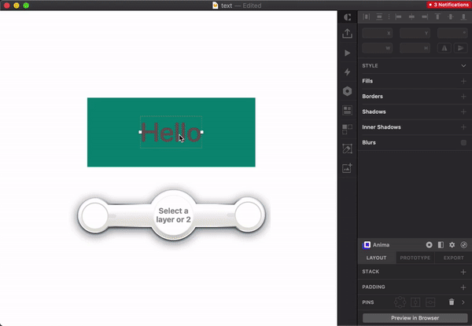

# Check Contrast
Check the colour contrast ratio of two layers in real time.

## Installation

- [Download](../../releases/latest/download/text-contrast.sketchplugin.zip) the latest release of the plugin
- Un-zip
- Double-click on text-contrast.sketchplugin

## What it does
Opens a panel so that you can view the colour contrast ratio and pick colours at the same time.

You can select a single layer and this plugin will do it's best to pick out the background layer's colour for you.

If you have two colours for checking then you can select two layers and the plugin will check for you.

# Issues and requests
You can ask me directly [@lifeofmle on Twitter](https://twitter.com/lifeofmle) or raise an [issue in Github](https://github.com/lifeofmle/check-contrast/issues/new)

## How to say thanks
If you are on Github, please 'star' this project on Github.

If you are on social media, please share this link with your team and friends.

If you want to donate to share the love, why not shout me a coffee ☕️, beer 🍺, or avocado 🥑 via [PayPal](https://www.paypal.me/lifeofmle/5)!
